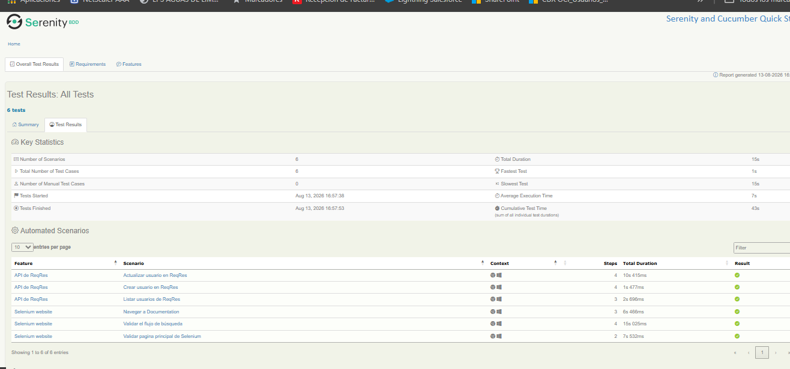

# QA Automation Challenge - Serenity BDD and Screenplay

Proyecto de automatización de pruebas Web y API desarrollado utilizando **Java, Serenity BDD, Screenplay, Selenium WebDriver, Cucumber y Serenity REST**.

El proyecto contiene pruebas automatizadas para validar funcionalidades de la página web de Selenium y servicios API de ReqRes.

---

## Tecnologías utilizadas

- Java 17
- Maven
- Serenity BDD 5.3.8
- Serenity Screenplay
- Serenity Screenplay WebDriver
- Serenity REST
- Selenium WebDriver
- Cucumber 7.34.2
- JUnit 6
- Chrome / ChromeDriver
- ReqRes API

---

## Casos automatizados

El proyecto contiene **6 escenarios automatizados**.

### Pruebas Web - Selenium

1. **Validar página principal de Selenium**

   - Verifica que la página principal de Selenium se encuentre disponible.

2. **Navegar a Documentation**

   - Verifica la navegación desde la página principal hacia la sección Documentation.

3. **Validar el flujo de búsqueda**

   - Realiza una búsqueda del término **WebDriver**.
   - Selecciona el primer resultado.
   - Valida que el título de la página corresponda a **WebDriver**.

### Pruebas API - ReqRes

4. **Listar usuarios**

   - Consulta la API de usuarios.
   - Valida el código de respuesta `200`.
   - Verifica que la respuesta contenga usuarios.

5. **Crear usuario**

   - Realiza una petición para crear un usuario.
   - Valida el nombre del usuario.
   - Valida el trabajo del usuario.

6. **Actualizar usuario**

   - Realiza una petición para actualizar un usuario.
   - Valida el nombre actualizado.
   - Valida el trabajo actualizado.
   - Valida el código de respuesta `200`.

---

## Estructura del proyecto

```text
src
├── test
│   ├── java
│   │   └── starter
│   │       ├── navigation
│   │       ├── questions
│   │       ├── stepdefinitions
│   │       ├── tasks
│   │       ├── ui
│   │       └── CucumberTestSuite.java
│   │
│   └── resources
│       ├── features
│       │   ├── reqres.feature
│       │   └── web.feature
│       │
│       ├── junit-platform.properties
│       └── serenity.conf
│
├── pom.xml
├── serenity.properties
├── .gitignore
└── README.md
```

---

## Clonar el repositorio

```bash
git clone https://github.com/davidtorres2601/qa-automation-serenity-screenplay.git
```

Ingresar al proyecto:

```bash
cd qa-automation-serenity-screenplay
```

---

## Ejecutar las pruebas

```bash
mvn clean verify
```

---

## Generar el reporte

```bash
mvn serenity:aggregate
```

El reporte se genera en:

```text
target/site/serenity/index.html
```

---

## Reporte de ejecución



---

## Autor

**David Torres**

QA Automation Engineer